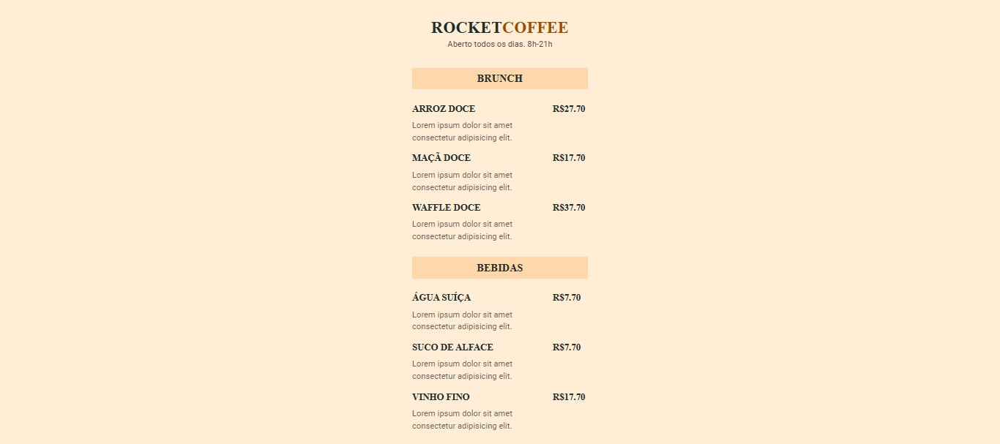

<h1 align="center"> Rocket Coffee </h1>

Projeto realizado durante a maratona explorer promovida pela Rocketseat durante os dias 07.08.2022 e 10.08.2022.  

  <a href="#technologies">Technologies</a>&nbsp;&nbsp;&nbsp;|&nbsp;&nbsp;&nbsp;
  <a href="#project">Project</a>

 

  

## 🚀 Technologies

Esse projeto foi desenvolvido com as seguintes tecnologias:

- HTML e CSS
- JavaScript
- Git e Github
- Figma

## 💻 Project

O projeto consiste em um cardápio virtual que exibe os produtos e os seus respectivos preços.

- [Visite o projeto online](https://maratonaexplorer03.netlify.app/)

---

Made with 💜 by raulrodmo

